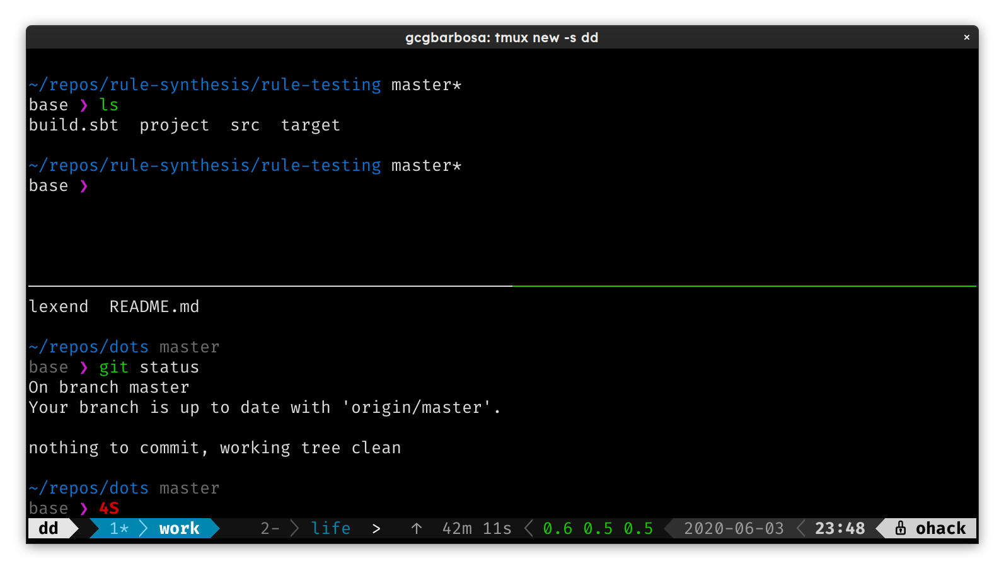

# George's dotfiles



### Features

|   1. **Vim**    | 2. **Tmux**  |    3. **zsh**      |
|-----------------|--------------|--------------------|
| Fuzzy finder    | powerline    | syntax highlight   |
| Autocompletion  | +plugins     | more completitions |
| Code formatter  |              | theming            |
| Linter          |              |                    |
| Theming         |              |                    |
| powerline       |              |                    |
| git integration |              |                    |


______

## ZSH 

Everything starts with good terminal.

I used [this](https://github.com/ohmyzsh/ohmyzsh/wiki/Installing-ZSH) tutorial to install it.

To customize the shell I use powerline.

- https://github.com/powerline/powerline

I use it with Vim and Tmux.

## Ctags

Ctags is used to "jump into" functions/classes.

Ctags does not support scala out of the box.
To enable it,
copy `.ctags` from this repo to `~` (home) and voila.
It shoud be working after you generate the tag list for the repository.
You press `ctrl+]` to jump into a function definition.
To go back you press `ctrl+t`.

## Vim

Here are some resurces I used to build this dotfiles:

- https://realpython.com/vim-and-python-a-match-made-in-heaven/
- https://medium.com/swlh/8-vim-tricks-that-will-take-you-from-beginner-to-expert-817ff4870245
- https://danielmiessler.com/blog/vim-configuration-update-2019-version/

Resources used to build the scala environment:

- https://scalameta.org/metals/docs/editors/vim.html
- http://seenaburns.com/vim-setup-for-scala/
- https://medium.com/@alandevlin7/neovim-scala-f392bcd8b7de
- https://github.com/Shougo/deoplete.nvim
- https://andrew.stwrt.ca/posts/vim-ctags/

This tutorial explains how to run VIM from scratch:
- https://github.com/ycm-core/YouCompleteMe/wiki/Building-Vim-from-source

### Managing plugins for vim

Plug is a plugin manager for vim.
The installation process of `plug` is very simple. Run:

```bash
curl -fLo ~/.vim/autoload/plug.vim --create-dirs \
    https://raw.githubusercontent.com/junegunn/vim-plug/master/plug.vim
```

- https://github.com/junegunn/vim-plug

To install plugins we run the following inside vim:

```
:PlugInstall
```

### Language Support

#### Scala

Simply install coc-metals.
I am also using metals to format scala code using the following inside vim:

```
:Format
```

- https://github.com/scalameta/coc-metals

#### Python

Install coc-python to get Python support.

- https://github.com/neoclide/coc-python

#### C/C++

Install coc-clangd to get C++/C autocompletion.

- https://github.com/clangd/coc-clangd

Note that you need `clang` installed.

#### Web development

I use the following plugins for coc:

```
:CocInstall coc-tsserver coc-eslint coc-json coc-prettier coc-css coc-html
```

- coc-tsserver: provides autocompletion for typescript
- coc-esslint: provides linting for javascript
- coc-json: provides json autocompletion
- coc-prettier: provides a wrapper to prettier
- coc-css: language server for css
- coc-html: language server for html

## Tmux

Tmux is both my mom and my dad.

The surprisingly new thing here is powerline:

Put this inside your .tmuxrc:

```
source /home/gcgbarbosa/anaconda3/lib/python3.7/site-packages/powerline/bindings/tmux/powerline.conf
```

Don't forget to replace it with your own `site-packages` folder path.

______
